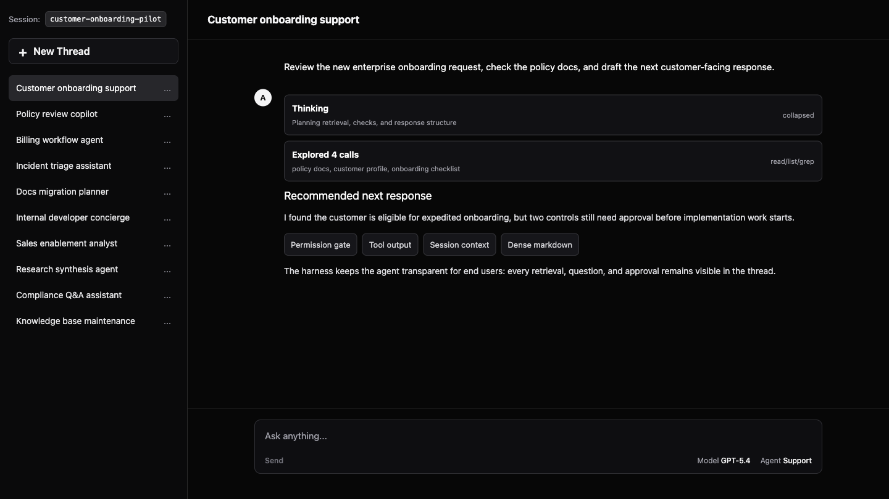
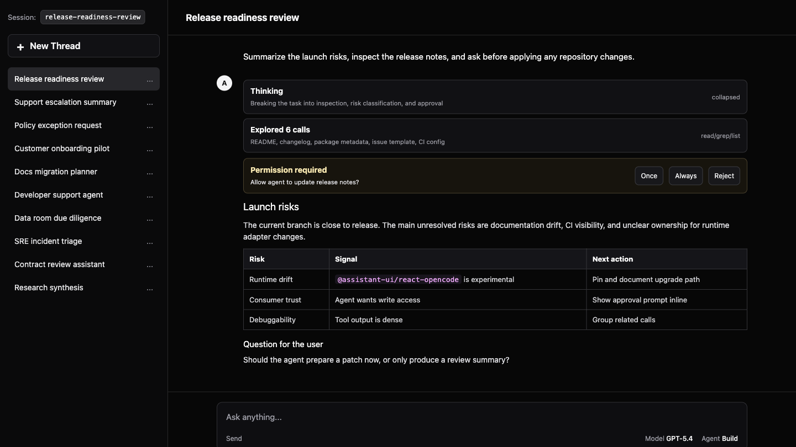

# assistant-ui Agent Harness UI

[](https://github.com/AnkurTeo/agent-harness-ui/actions/workflows/ci.yml)
[](LICENSE)
[](https://react.dev/)
[](https://vite.dev/)
[](https://opencode.ai/)

Reusable UI support for agentic harnesses. The first supported harness is
OpenCode: a Vite + React implementation that makes
[`@assistant-ui/react-opencode`](https://www.assistant-ui.com/docs/runtimes/opencode/overview)
usable as a product-facing agent experience.

It keeps the assistant-ui runtime intact and customizes only the renderer layer:
compact tool rows, grouped explore calls, OpenCode-style markdown, session
titles, model/agent selectors, permission prompts, question prompts, and a dark
theme by default.



## Why This Exists

Many teams already have a working agent loop: a CLI agent, an internal coding
agent, a workflow runner, or a local harness that can plan, call tools, ask
questions, and produce useful results. The hard part is often the product
surface around it. End consumers need to see what the agent is doing, understand
why it wants permissions, inspect intermediate tool output, answer blocking
questions, and resume work across sessions.

Agent Harness UI sits between a capable agent runtime and an end-user product
experience. It does not replace the agent orchestration layer. It provides the
browser UI primitives that make an agent presentable, debuggable, and safer to
operate.

## Use Cases

- **Expose internal agents to business users:** wrap a working support,
  operations, research, or migration agent in a browser UI with session history,
  readable markdown, and clear next actions.
- **Ship technical copilot experiences:** present a CLI or local harness as an
  application surface for developers, SREs, analysts, or implementation teams.
- **Add trust boundaries around tool use:** show permission prompts, write
  requests, file reads, shell commands, and grouped exploration steps before an
  agent continues.
- **Standardize multi-agent workflows:** render subagent work, reasoning, task
  boundaries, and follow-up questions in one consistent thread.
- **Prototype new harness integrations:** keep runtime adapters separate from
  renderer components so OpenCode is only the first supported backend.

## Project Status

This repo is intentionally narrow right now: polish the agent-chat UI surface
for OpenCode first, then keep the component seams reusable for future harnesses.
`@assistant-ui/react-opencode` is still experimental and pinned to `0.0.3`, so
runtime compatibility may need updates as upstream APIs change.

## Features

- Direct browser client for `opencode serve`.
- Dark theme with overridable CSS tokens.
- Server-side OpenCode session title in the thread header.
- Docked composer with OpenCode questions, permission prompts, model selector,
  and agent selector.
- Collapsible `Thinking` bubbles for reasoning parts, closed by default after
  completion.
- OpenCode-style question prompt with numbered steps, Back/Next, and one final
  submit for multi-question requests.
- Compact tool UI for shell, explore, web, todo, edit, patch, write, and task
  calls.
- Adjacent `read/list/glob/grep` calls grouped as `Explored` / `Exploring`.
- Markdown tuned for agent-chat density instead of marketing-page typography.
- Public `OpenCodeApp` wrapper for component and theme overrides.

## Scope

In scope:

- Reusable React components for agent harness chrome, prompts, tool calls, and
  markdown.
- OpenCode integration through the public assistant-ui OpenCode runtime.
- Documentation for customization and renderer contracts.

Out of scope:

- Forking assistant-ui runtime internals.
- Backend orchestration for agents.
- Product-specific workflows that make the UI harder to reuse across harnesses.

## Screenshots

### Agent Harness Shell


### Tool Output, Permissions, and Markdown



## Quick Start

Run OpenCode and the Vite app in two terminals.

```bash
# terminal 1
opencode serve

# terminal 2
npm install
npm run dev
```

Open `http://localhost:5173`.

The app expects OpenCode at `http://127.0.0.1:4096`. To change that:

```bash
cp .env.example .env
```

Then edit:

```bash
VITE_OPENCODE_URL=http://127.0.0.1:4096
```

## OpenCode Components Included

| Area | Components |
| --- | --- |
| Runtime shell | `OpenCodeApp`, `MyRuntimeProvider`, `Layout`, `OpencodeThread` |
| Composer | `DockedComposer`, `QuestionPrompt`, `PermissionPrompt`, `ModelToggle`, `AgentToggle` |
| Thread chrome | `ThreadHeader`, `SessionInfo`, `ThreadList`, `InterruptedMarker` |
| Thinking | `Reasoning`, `ReasoningGroup`, `ReasoningTrigger`, `ReasoningContent` |
| Tool primitive | `OpenCodeTool`, `ToolGroup`, `ToolFallback` |
| Tool renderers | `BashTool`, `ReadTool`, `ListTool`, `GlobTool`, `GrepTool`, `WebFetchTool`, `WebSearchTool`, `TodosTool`, `EditTool`, `TaskTool` |
| Markdown | `MarkdownText`, code copy header, GFM tables/lists/blockquote styling |

See [docs/components.md](docs/components.md) for the full component map.

## Override Theme and Components

```tsx
import { OpenCodeApp, BashTool } from "./opencode-ui";

export default function App() {
  return (
    <OpenCodeApp
      theme={{
        mode: "dark",
        variables: {
          "oc-inline-code": "291 93% 83%",
        },
      }}
      components={{
        tools: {
          bash: BashTool,
        },
      }}
      strings={{
        composer: {
          input: {
            placeholder: "Ask your agent...",
          },
        },
      }}
    />
  );
}
```

Supported overrides include the composer, assistant message renderer, markdown
renderer, sidebar pieces, context group, unknown tool fallback, and per-tool
renderers. See [docs/customization.md](docs/customization.md).

## Tool Renderer Contract

Tool renderers intentionally use only the projected assistant-ui OpenCode props:

- `toolName`
- `args`
- `argsText`
- `result`
- `status`
- `toolCallId`

Do not depend on raw OpenCode metadata in UI components. If richer metadata is
needed, add a small projection adapter upstream instead of scraping hidden
runtime state.

## Scripts

```bash
npm run dev       # Vite dev server
npm run typecheck # TypeScript project build
npm run build     # Typecheck + production build
npm run preview   # Serve production build locally
```

## Repository Hygiene

- Runtime configuration lives in `.env`; copy `.env.example` when needed.
- Generated output such as `dist/`, `node_modules/`, `.DS_Store`, and
  TypeScript build info is ignored.
- Local Codex/agent skill folders under `.agents/` are ignored and should not be
  committed with the sample app.

## Troubleshooting

### CORS Rejection

If the browser blocks OpenCode requests, either configure OpenCode to accept
`http://localhost:5173` or proxy through Vite and set `VITE_OPENCODE_URL` to the
proxy path.

### No Reply Streams In

Check that `opencode serve` is running:

```bash
curl http://127.0.0.1:4096/config
```

The sample intentionally disables React StrictMode because
`@assistant-ui/react-opencode@0.0.3` can dispose its shared event source during
StrictMode remounts.

### Tool UI Looks Like Raw JSON

Confirm the tool name exists in `openCodeToolsByName` in `src/tools/index.ts`.
Unknown tools fall back to `ToolFallback`.

## Contributing

See [CONTRIBUTING.md](CONTRIBUTING.md).

## License

MIT. See [LICENSE](LICENSE).
