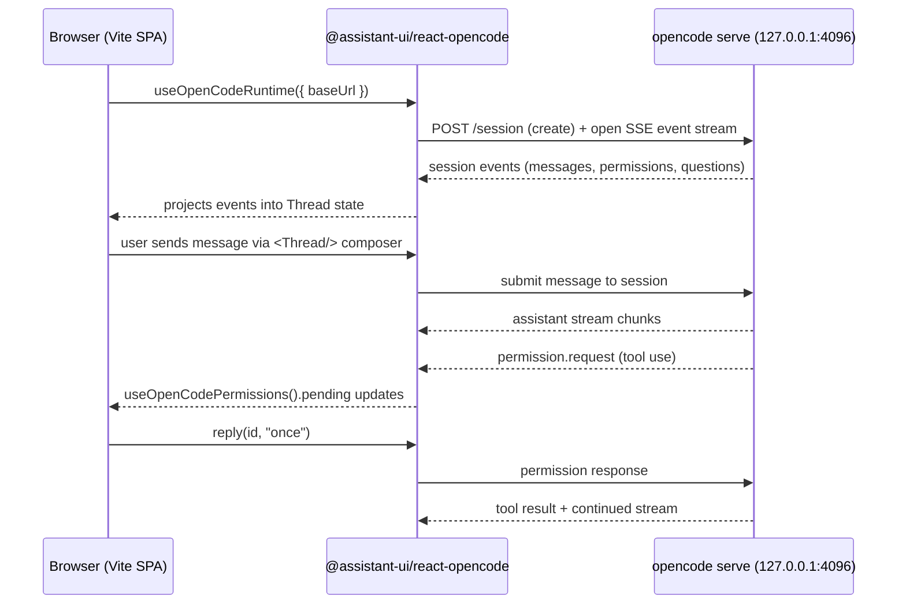

# assistant-ui + OpenCode barebones integration sample - design

- **Date:** 2026-05-01
- **Location:** standalone `agent-harness-ui` repository
- **Status:** design approved, ready for implementation plan

## Goal

Stand up the smallest possible browser app that proves the
[`@assistant-ui/react-opencode`](https://www.assistant-ui.com/docs/runtimes/opencode/overview)
runtime can drive a real `opencode serve` instance end-to-end — including the
hook surfaces that the host app needs to complete an agent turn (permissions,
questions). This is a POC scoped to debug an integration issue; it is not a
product.

### Success criteria

1. Browser app boots against a locally running `opencode serve` on
   `http://127.0.0.1:4096` with no server-side code in this project.
2. User can send a chat message; the OpenCode server responds and the reply
   streams into the assistant-ui `Thread`.
3. When the agent requests a tool permission, the `PermissionPrompt` UI shows
   the request and the user's response ("once" / "always" / "reject") unblocks
   the turn.
4. When the agent asks an interactive question, the `QuestionPrompt` UI
   surfaces it and the user's answer (or skip) unblocks the turn.
5. The current session id is visible on screen for debugging.

Non-goal: polish, theming, session list, auth, multi-thread, production
deployment.

## Non-negotiable constraints

- **Follow the assistant-ui OpenCode docs verbatim.** API names (`baseUrl`,
  `initialSessionId`, `useOpenCodeRuntime`, `useOpenCodePermissions`,
  `useOpenCodeQuestions`, `useOpenCodeSession`, `useOpenCodeRuntimeExtras`) come
  from the docs pages listed in *References*; do not rename or guess.
- **Pin the experimental package.** `@assistant-ui/react-opencode` is v0.0.3
  and marked experimental. Pin the exact version so upstream changes don't
  silently break the POC.
- **Lives outside the TMigrate monorepo.** This directory is a standalone
  project; it is not part of `/Users/ankurteotia/Desktop/legacymigration/` and
  must not import from it.

## Stack

| Concern | Choice |
| --- | --- |
| Build tool | Vite 5 |
| Framework | React 18 + TypeScript |
| Runtime UI | `@assistant-ui/react` |
| OpenCode adapter | `@assistant-ui/react-opencode@0.0.3` (pinned) |
| OpenCode transport SDK | `@opencode-ai/sdk` |
| Styling | Tailwind CSS (required by assistant-ui's `Thread`) |
| Server | none — pure SPA; browser talks directly to `127.0.0.1:4096` |

Next.js was considered to match the quickstart's `"use client"` directive
verbatim. Rejected: Vite components are already client-side, so the only
difference is a string literal. Vite keeps the POC lighter and avoids a Node
server this project doesn't need.

## File layout

```
agent-harness-ui/
  index.html
  package.json
  tsconfig.json
  tsconfig.node.json
  vite.config.ts
  tailwind.config.ts
  postcss.config.js
  .env.example                 # VITE_OPENCODE_URL=http://127.0.0.1:4096
  .gitignore
  README.md
  docs/superpowers/specs/      # this document
  src/
    main.tsx                   # React root
    App.tsx                    # <MyRuntimeProvider><Layout/></MyRuntimeProvider>
    MyRuntimeProvider.tsx      # useOpenCodeRuntime + AssistantRuntimeProvider
    Layout.tsx                 # Thread + prompts + session strip
    PermissionPrompt.tsx       # useOpenCodePermissions
    QuestionPrompt.tsx         # useOpenCodeQuestions + useOpenCodeRuntimeExtras
    SessionInfo.tsx            # useOpenCodeSession
    index.css                  # Tailwind directives
    vite-env.d.ts
```

Each file has one job. Swapping the runtime provider, the permission UI, or
the question UI should not require touching the others.

## Component responsibilities

### `MyRuntimeProvider.tsx`
- Calls `useOpenCodeRuntime({ baseUrl })`.
- Wraps children in `AssistantRuntimeProvider`.
- `baseUrl` is read from `import.meta.env.VITE_OPENCODE_URL`; falls back to
  `http://127.0.0.1:4096`.

### `Layout.tsx`
- Full-height flex column: `SessionInfo` on top, `Thread` in the middle
  (scrollable), `QuestionPrompt` + `PermissionPrompt` docked at the bottom.
- No business logic; pure arrangement.

### `PermissionPrompt.tsx`
- Consumes `{ pending, reply }` from `useOpenCodePermissions()`.
- Renders nothing when `pending` is empty.
- For each request, shows `toolName` + `title ?? permission` with three
  buttons that call `reply(req.id, "once" | "always" | "reject")`.

### `QuestionPrompt.tsx`
- Consumes questions from `useOpenCodeQuestions()` and
  `{ replyToQuestion, rejectQuestion }` from `useOpenCodeRuntimeExtras()`.
- Renders nothing when the queue is empty.
- MVP: a single "Answer" button sends `[]` (empty answer list) and a "Skip"
  button rejects. Good enough to prove the plumbing without building a full
  multiple-choice UI.

### `SessionInfo.tsx`
- Consumes `useOpenCodeSession()`.
- Displays the session id, or "No session yet" before one is created.
- Exists purely as a debug aid to verify the SSE stream attached.

### `App.tsx` / `main.tsx` / `index.css`
- Standard Vite boilerplate; no custom logic.

## Data / event flow



## Configuration

- `VITE_OPENCODE_URL` — base URL for `opencode serve`. Default
  `http://127.0.0.1:4096`. Documented in `.env.example` and `README.md`.
- No other runtime configuration. `defaultAgent`, `defaultModel`,
  `initialSessionId`, and a custom `createOpencodeClient` are all deliberately
  omitted — they are POC follow-ons, not required to prove the integration.

## Runbook

```bash
# terminal 1
opencode serve                      # listens on 127.0.0.1:4096 by default

# terminal 2
cd agent-harness-ui
cp .env.example .env                # optional — only if overriding the URL
npm install
npm run dev                         # Vite serves http://localhost:5173
```

Open the Vite URL, type a message in the `Thread` composer, confirm a reply
streams in. Then ask for something that forces a tool call (e.g. "read
package.json"); confirm the permission prompt appears and approving it lets
the turn complete.

## Known risks & fallbacks

| Risk | Surface | Mitigation |
| --- | --- | --- |
| CORS rejection from `opencode serve` for origin `http://localhost:5173` | Network tab shows blocked preflight / SSE | Add a Vite dev proxy in `vite.config.ts` forwarding `/opencode/*` → `127.0.0.1:4096`; set `VITE_OPENCODE_URL=/opencode`. Implement only if CORS actually fires — keep the default path same-origin-free. |
| v0.0.3 API drift | Build break after `npm install` in a new environment | Pin `@assistant-ui/react-opencode` at exactly `0.0.3` in `package.json`. |
| Tool call blocks forever without a permissions UI | Agent turn never completes | Mitigated in design: `PermissionPrompt` is in-scope. |
| Tailwind misconfigured, `Thread` renders unstyled | Visually broken but functional | README troubleshooting section covers the Tailwind content globs to check. |
| OpenCode server returns no session | `SessionInfo` stays on "No session yet" | Use `SessionInfo` + browser devtools to confirm the SSE connected before debugging deeper. |

## Out of scope (POC follow-ons, not required)

- `initialSessionId` / session picker / resume across reloads.
- `defaultAgent` / `defaultModel` props.
- Custom client via `createOpencodeClient` (auth headers, alternate fetch).
- `useOpenCodeThreadState`, `useOpenCodeRuntimeExtras` power actions
  (`fork`, `revert`, `unrevert`, `cancel`, `refresh`).
- Multiple threads / `RemoteThreadList`.
- Rich `QuestionPrompt` UI (real answer inputs per question shape).
- Styling, branding, dark mode.
- Production build hardening, CI, tests.

## References

- Overview: https://www.assistant-ui.com/docs/runtimes/opencode/overview
- Quickstart: https://www.assistant-ui.com/docs/runtimes/opencode/quickstart
- Hooks: https://www.assistant-ui.com/docs/runtimes/opencode/hooks
